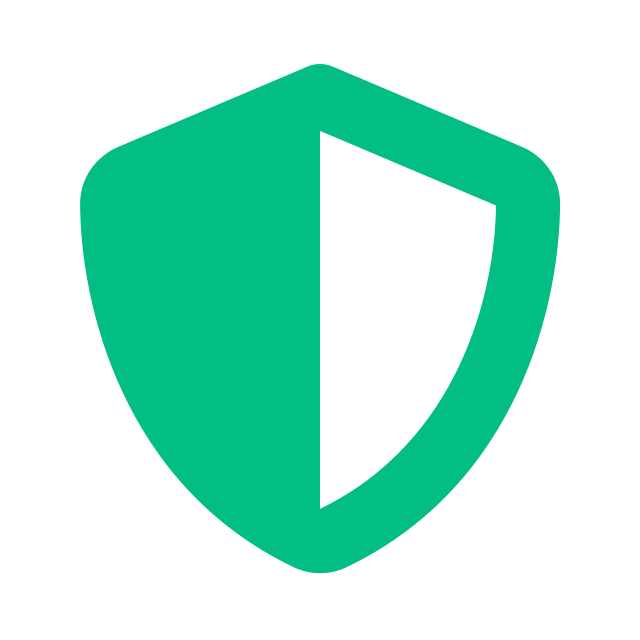

<div align="center">
  
</div>

# 🔒 Zero Vault - Zero-Knowledge Secret Manager

A secure, zero-knowledge secret manager that stores encrypted secrets without ever exposing plaintext content or the master password to the server.

## 🚀 Quick Start (TL;DR)

```bash
# Pull and run from Docker Hub
docker compose -f docker-compose.zero-vault.yml up -d

# Access at: http://localhost:8766
```

> 📦 **Docker Hub**: [`surajadev/zero-vault`](https://hub.docker.com/r/surajadev/zero-vault)

## ✨ Features

- 🔒 **Zero-Knowledge Encryption**: All secrets are encrypted and decrypted client-side. The backend never sees your plaintext data.
- 🔐 **Secret Management**: Full CRUD operations for secure notes and credentials.
- 🎨 **Modern Cyber UI**: Beautiful dark theme with a "cyber" look, glassmorphism, and responsive design.
- ⚙️ **Settings**: User profile and security configuration.

## 🏗️ Architecture

### 🐍 Backend (FastAPI + Python)
- **Framework**: FastAPI ⚡
- **Database**: SQLite 💾
- **Security**: Zero-knowledge mechanisms, secure token-based authentication 🛡️

### ⚛️ Frontend (React + TypeScript)
- **Framework**: React 19 with TypeScript 💙
- **Build Tool**: Vite ⚡
- **Styling**: Tailwind CSS 🎨
- **Icons**: Lucide React 🎯
- **HTTP Client**: Axios 🌐

## 🚀 Quick Start

### 📋 Prerequisites
- 🐍 Python 3.8+
- 📦 Node.js 18+
- 🐳 Docker installed and running

### 🔧 Backend Setup

1️⃣ Create and activate virtual environment:
```bash
python -m venv venv
# Windows
venv\Scripts\activate
# Linux/Mac
source venv/bin/activate
```

2️⃣ Install dependencies:
```bash
pip install -r requirements.txt
```

3️⃣ Configure environment:
```bash
# Copy .env.example to .env and configure
cp .env.example .env
```

4️⃣ Run the backend:
```bash
uvicorn app.main:app --reload --host 0.0.0.0 --port 8000
```

✅ Backend will be available at `http://localhost:8000`  
📚 API documentation at `http://localhost:8000/docs`

> **💡 Note**: When running via Docker, the application will be available at `http://localhost:8766`

### 🎨 Frontend Setup

1️⃣ Navigate to UI folder:
```bash
cd ui
```

2️⃣ Install dependencies:
```bash
npm install
```

3️⃣ Start development server:
```bash
npm run dev
```

✅ Frontend will be available at your local development server URL (typically `http://localhost:5173` or `http://localhost:3000`)

## 🔐 Authentication

Zero Vault employs a zero-knowledge architecture.
You must register an account and remember your master password.
**The server cannot recover your data if you lose your master password.**

**Access Points:**
- 🌐 **Application**: `http://localhost:8766` (Docker) or your local frontend URL.

## 📖 API Documentation

Full API documentation is available at `/docs` when the backend is running.

🔑 Key endpoints:
- 🔐 `/auth` - Authentication and user registration
- 📝 `/secrets` - Secret management (encrypted blobs only)
- ⚙️ `/settings` - User settings management

## 📁 Project Structure

```
zero-vault/
├── 🐍 app/                 # Backend application
│   ├── 🛣️ controllers/     # API route handlers
│   ├── ⚙️ core/           # Core configuration
│   ├── 💾 models/         # Database models
│   ├── 📋 schemas/        # Pydantic schemas
│   └── 🔧 services/       # Business logic & Database interaction
├── ⚛️ ui/                 # Frontend application
│   └── src/
│       ├── 🧩 components/ # React components
│       ├── 📄 pages/      # Page components
│       ├── 🌐 api.ts      # API client
│       └── 📝 types.ts    # TypeScript types
├── 📦 requirements.txt    # Python dependencies
└── 📖 README.md          # This file
```

## 💻 Development

### 🐳 Docker Deployment (Recommended)

Zero Vault is available as a pre-built Docker image on Docker Hub for easy deployment.

#### 🚀 Option 1: Docker Hub (Production - Fastest)

**Pull and run the latest image:**

```bash
# Pull the image
docker pull surajadev/zero-vault:latest

# Run with Docker
docker run -d \
  --name zero-vault \
  -p 8766:8000 \
  -v ./data:/app/data \
  -e JWT_SECRET_KEY=your-secret-key-here \
  -e TZ=Asia/Colombo \
  --restart unless-stopped \
  surajadev/zero-vault:latest
```

**Or use Docker Compose (Recommended):**

```bash
# Use the Zero Vault compose file
docker compose -f docker-compose.zero-vault.yml up -d
```

**Configuration:**
1. Copy `.env.example` to `.env`
2. Update the `JWT_SECRET_KEY` in `.env` (important for production!)
3. Run: `docker compose -f docker-compose.zero-vault.yml up -d`

#### 🔧 Option 2: Build Locally (Development)

**Build and run from source:**

```bash
# Build the image
docker build -t zero-vault:latest .

# Run with docker-compose
docker compose up -d
```

This option builds the image locally, which is useful for development or customization.

## 🎯 Features in Detail

### 🔒 Zero-Knowledge Architecture
- ✅ Master password is used to derive encryption keys entirely on the client side.
- 🛡️ AES-GCM or equivalent authenticated encryption is used before data is sent over the network.
- 👁️‍🗨️ The server only receives and stores opaque, encrypted blobs and cannot decrypt your data.

### 🔐 Secret Management
- 📝 Create secure notes and credentials.
- ✏️ Edit your stored secrets as needed.
- 🗑️ Permanently and securely delete obsolete secrets.

### 🧑‍💻 User Settings
- ⚙️ Manage your profile and security credentials seamlessly.

## 🤝 Contributing

Contributions are welcome! Please feel free to submit a Pull Request.

## 📄 License

MIT License - see LICENSE file for details
